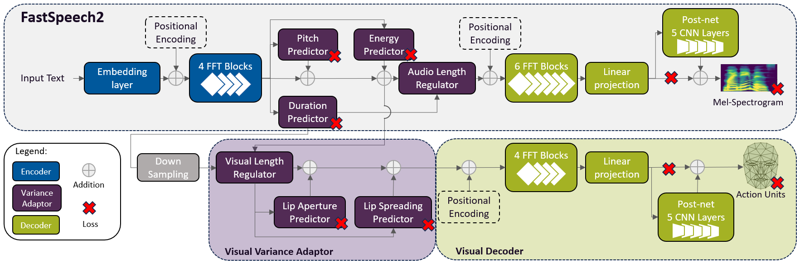

This repository shares the implementation of the Audiovisual Text-To-Speech model __FastLips__ proposed in the paper: [FastLips: an End-to-End Audiovisual Text-to-Speech System with Lip Features Prediction for Virtual Avatars]().

This implementation is branched from the [GIPSA-Lab's TTS model for the Blizzard Challenge 2023](https://github.com/MartinLenglet/Blizzard2023_TTS) of FastSpeech2 ([link to the paper](https://hal.science/hal-04269935/document)). FastLips implements a Transformer-based visual decoder with explicit prediction of lip aperture and spreading. 

# FastLips

The FastLips architecture follows the FastSpeech2 architecture described in [FastSpeech 2: Fast and High-Quality End-to-End Text to Speech](https://arxiv.org/abs/2006.04558). The Transformer-based audio decoder is duplicated into a visual decoder which predicts Action Units (AU) used to drive the deformation of the 3D model of a virtual avatar. The model implements a single audiovisual text-encoder which computes unified representations that are shared by the two decoders.

The variance adaptor implemented in FastSpeech2 is adapted into a visual variance adaptor. The visual variance adaptor computes the explicit prediction of lip aperture and spreading at the frame-level. Similar to the explicit prediction of pitch and energy in FastSpeech2, lip aperture and spreading are predicted as scalar values which is converted into an embedding that is added to the corresponding frame embeddings of the phone.

The same duration predictor is used to predict the alignment between the text input and the audio and visual sequences. The output audio and visual sequences may differ in sampling rate. In this case, the duration predicted for the audio sequence is scaled accordingly.

A convolutional Tacotron2-like PostNet is implemented for the visual sequence.



# Modifications to the [GIPSA-lab's TTS Implementation](https://github.com/MartinLenglet/Blizzard2023_TTS)

This implementation uses the format of the [French corpus](https://zenodo.org/records/7560290#.Y85YpC_pMzw) shared by [Blizzard Challenge 2023](https://hal.science/hal-04269927/document) Organizers.

## Preprocessing
1. formatting scripts from the Blizzard dataset format to LJSpeech-like format with `format_input_file.py`
2. addition of visual parameters in configuration files
3. adaptation of the preprocessing script for visual features in `preprocessor/mailabs.py` (adapt this script to your corpus)

## Data Loading
4. loading of AU and lip aperture and spreading features in `dataset.py`

## Visual Prediction
5. prediction of the AU sequence and lip features in the variance adaptor `model/modules.py`
6. computation of the visual losses (Mean Absolute Error summed to the total loss) in `model/loss.py` during training

## Modular Implementation
7. optional phonetic prediction sub-task
8. optional postnet after the visual decoder
9. optional lip prediction sub-task
10. training on sparse-corpus (missing visual features allowed)

# Demo Page
Visit our [demo page]() for video samples of our virtual avatar driven by audiovisual features predicted with [AVTacotron2](https://dl.acm.org/doi/abs/10.1145/3462244.3479883) and our proposed __FastLips__ model. 

# Vocoder trained separately

This implementation is not intended to be trained jointly with a neural vocoder.

# Quickstart

## Pre-requisites
1. NVIDIA GPU + CUDA cuDNN

## Setup
1. Download/Clone this repo
2. Install python requirements: 
```
pip install -r requirements.txt
```
3. Update configuration files

## Preprocessing
4. Segment audio files by utterance: 
```
python3 prepare_align.py
```
5. Compute mel, AU, pitch, energy and lip features by utterance: 
```
python3 preprocess.py
```
6. Format csv files: 
```
python3 format_input_file.py
```
7. Random segmentation of training and test sets: 
```
python3 create_test_eval_sets.py
```

## Training
```
python3 train.py -p config/Lips_Pred/preprocess.yaml -m config/Lips_Pred/model_postnet_pred_aperture_spreading.yaml -t config/Lips_Pred/train_postnet_pred_aperture_spreading.yaml
```

## Download our checkpoint
You can download the [checkpoint](https://drive.google.com/drive/folders/1bABLRHqpJs3009npHHEmeMp0AZLC8f-p?usp=sharing) we used to synthesize the test stimuli evaluated in [our paper]().

## Inference
```
python3 synthesize.py --source preprocessed_data/ALL_corpus/test_AD_neutral_FS.txt --restore_step 40000 --mode batch -p config/Lips_Pred/preprocess.yaml -m config/Lips_Pred/model_postnet_pred_aperture_spreading.yaml -t config/Lips_Pred/train_postnet_pred_aperture_spreading.yaml
```

# Acknowledgements
This research has received funding from the BPI project THERADIA and MIAI@Grenoble-Alpes (ANR-19-P3IA-0003). This work was granted access to HPC/IDRIS under the allocation 2023-AD011011542R2 made by GENCI.

<!-- # Citation
    @inproceedings{lenglet2024fastlips,
        title={FastLips: an End-to-End Audiovisual Text-to-Speech System with Lip Features Prediction for Virtual Avatars},
        author={Lenglet, Martin and Perrotin, Olivier and Bailly, G{\'e}rard},
        booktitle={Proc. of Interspeech},
        pages={to be updated},
        year={2024},
        organization={ISCA}
    } -->